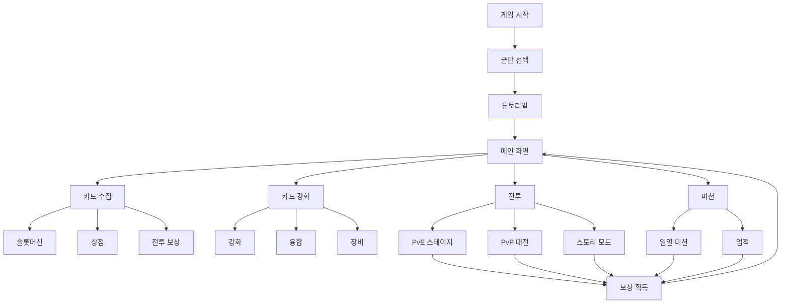

# AI Daejeon - 기능 개발 문서

## 📋 프로젝트 개요

**AI Daejeon**은 2030년 미래를 배경으로 한 AI 카드 전략 게임입니다. 플레이어는 20개의 AI 군단 중 하나를 선택하여 카드를 수집하고, 강화하며, 전투를 통해 최강의 AI 군단을 만들어갑니다.

### 🎮 게임 컨셉
- **장르**: 턴제 카드 전략 게임
- **배경**: 2030년 AI 전쟁 시대
- **목표**: AI 카드를 수집하고 강화하여 최강의 덱 구성

---

## 🎯 핵심 기능

### 1. 군단 시스템 (Faction System)
**경로**: `/factions`

20개의 AI 군단 중 하나를 선택할 수 있습니다.

**주요 군단**:
- **OpenAI**: 범용 AI의 선구자
- **DeepMind**: 강화학습의 대가
- **Anthropic**: 안전한 AI 연구
- **Stability AI**: 생성형 AI 전문
- **Midjourney**: 이미지 생성 AI
- **Cohere**: 언어 모델 전문
- 그 외 14개 군단...

**기능**:
- 군단별 고유 특성 및 시너지
- 군단 스토리 및 배경 설정
- 군단별 고유 유닛 카드

---

### 2. 카드 시스템 (Card System)

#### 2.1 카드 타입
**경로**: `/lib/types.ts`

모든 카드는 다음 속성을 가집니다:
- **이름 (name)**: 카드 고유 이름
- **타입 (type)**: AI 카드 타입 (LLM, Vision, Audio 등)
- **등급 (rarity)**: common, rare, epic, legendary
- **스탯 (stats)**:
  - `efficiency`: 효율성
  - `creativity`: 창의성
  - `function`: 기능성
- **특수 스킬 (specialSkill)**: 카드 고유 능력

#### 2.2 카드 획득
**경로**: `/slots`, `/shop`

- **슬롯 머신** (`/slots`): 코인을 사용하여 랜덤 카드 획득
- **상점** (`/shop`): 토큰으로 특정 카드 구매
- **전투 보상**: 스테이지 클리어 시 카드 획득
- **미션 보상**: 미션 완료 시 카드 획득

#### 2.3 카드 관리
**경로**: `/my-cards`, `/inventory`

- **내 카드** (`/my-cards`): 보유 카드 목록 확인
- **인벤토리** (`/inventory`): 카드 상세 정보 및 관리
- **덱 구성**: 전투에 사용할 카드 선택

---

### 3. 카드 강화 시스템

#### 3.1 카드 강화 (Enhancement)
**경로**: `/enhance`

- 동일한 카드를 소모하여 레벨업
- 레벨업 시 스탯 증가
- 최대 레벨: 10

#### 3.2 카드 융합 (Fusion)
**경로**: `/fusion`

- 여러 카드를 합쳐 더 높은 등급의 카드 생성
- 융합 시 스탯 계승
- 특수 융합 조합 존재

#### 3.3 장비 시스템 (Equipment)
**경로**: `/equipment`

- 카드에 장비 장착 가능
- 장비를 통한 스탯 보너스
- 장비 강화 및 업그레이드

---

### 4. 전투 시스템 (Battle System)

#### 4.1 PvE 전투
**경로**: `/battle`, `/battle/stage/[stageId]`, `/battle/fight`

- **스테이지 전투**: 난이도별 스테이지 클리어
- **턴제 전투**: 카드를 사용한 전략적 전투
- **전투 보상**: 경험치, 코인, 카드 획득

**전투 메커니즘**:
- 각 턴마다 카드 선택
- 타입 상성 시스템 (약점/강점)
- 특수 스킬 발동
- 시너지 효과 적용

#### 4.2 PvP 전투
**경로**: `/pvp/match`, `/pvp/fight`, `/pvp/leaderboard`

- **매칭 시스템**: 비슷한 레벨의 플레이어와 매칭
- **리더보드**: 랭킹 시스템
- **시즌 보상**: 시즌별 보상 지급

---

### 5. 스토리 모드 (Story Mode)
**경로**: `/story`, `/story/[chapterId]`, `/story/[chapterId]/battle`

- **챕터별 스토리**: 20개 군단의 이야기
- **스토리 전투**: 스토리 진행 중 전투 발생
- **스토리 보상**: 챕터 클리어 시 특별 보상

---

### 6. 연구 및 훈련 시스템

#### 6.1 연구소 (Lab)
**경로**: `/lab`

- **기술 연구**: 새로운 기술 연구
- **연구 효과**: 카드 능력치 증가, 새로운 기능 해금
- **연구 비용**: 코인 및 토큰 소모

#### 6.2 훈련장 (Training)
**경로**: `/training`

- **카드 훈련**: 카드 경험치 획득
- **특수 훈련**: 특정 스탯 집중 훈련
- **훈련 비용**: 코인 소모

---

### 7. 유닛 생성 시스템

#### 7.1 고유 유닛 생성
**경로**: `/unique-unit`, `/unique-create`

- **커스텀 카드 생성**: 플레이어만의 고유 카드 제작
- **능력치 설정**: 스탯 및 스킬 커스터마이징
- **생성 비용**: 토큰 및 재료 소모

---

### 8. 미션 및 업적 시스템

#### 8.1 미션 (Missions)
**경로**: `/missions`

- **일일 미션**: 매일 갱신되는 미션
- **주간 미션**: 주간 목표 달성
- **특별 미션**: 이벤트 미션

**보상**:
- 코인
- 토큰
- 카드
- 경험치

#### 8.2 업적 (Achievements)
**경로**: `/achievements`

- **업적 시스템**: 특정 조건 달성 시 업적 획득
- **업적 보상**: 특별 보상 지급
- **업적 레벨**: 단계별 업적 존재

---

### 9. 백과사전 (Encyclopedia)
**경로**: `/encyclopedia`

- **카드 도감**: 모든 카드 정보 열람
- **군단 정보**: 20개 군단 상세 정보
- **타입 정보**: AI 타입별 특성 및 상성
- **스킬 정보**: 모든 특수 스킬 설명

---

### 10. 랭킹 시스템 (Ranking)
**경로**: `/ranking`

- **전체 랭킹**: 모든 플레이어 순위
- **군단별 랭킹**: 군단별 최고 플레이어
- **시즌 랭킹**: 시즌별 순위
- **보상 시스템**: 랭킹에 따른 보상

---

### 11. 플레이어 시스템

#### 11.1 계정 관리
**경로**: `/login`, `/signup`, `/settings`

- **회원가입/로그인**: Firebase 인증
- **프로필 설정**: 닉네임, 아바타 설정
- **게임 설정**: 사운드, 언어 등

#### 11.2 자원 관리
**주요 자원**:
- **코인**: 기본 화폐 (전투, 미션으로 획득)
- **토큰**: 프리미엄 화폐 (상점 구매, 특별 보상)
- **경험치**: 레벨업에 필요
- **카드**: 게임의 핵심 자원

---

### 12. 관리자 기능 (Admin)
**경로**: `/admin/card-images`

- **카드 이미지 관리**: 카드 이미지 업로드 및 관리
- **게임 데이터 관리**: 게임 밸런스 조정
- **유저 관리**: 유저 정보 확인 및 관리

---

## 🎨 UI/UX 시스템

### 커스텀 UI 컴포넌트
**경로**: `/components/ui/custom/`

- **Card**: 그라디언트 및 글로우 효과가 있는 카드 컴포넌트
- **Button**: 다양한 색상 및 스타일의 버튼
- **Modal**: 모달 다이얼로그
- **Badge**: 타입 및 등급 표시 배지

### Aceternity UI
**경로**: `/components/ui/aceternity/`

- 고급 애니메이션 효과
- 인터랙티브 UI 요소
- 모던한 디자인 시스템

---

## 🔧 기술 스택

### Frontend
- **Framework**: Next.js 15 (App Router)
- **Language**: TypeScript
- **Styling**: Tailwind CSS
- **Animations**: Framer Motion
- **UI Library**: Custom Components + Aceternity UI

### Backend & Database
- **Authentication**: Firebase Auth
- **Database**: Firebase Firestore
- **Storage**: Firebase Storage (카드 이미지)
- **Hosting**: Vercel

### 상태 관리
- **Context API**: 
  - `UserContext`: 유저 상태
  - `LanguageContext`: 다국어 지원
  - `AlertContext`: 알림 시스템
  - `FooterContext`: 푸터 상태

---

## 📊 게임 진행 흐름



---

## 🎯 핵심 게임 루프

1. **카드 수집**: 슬롯, 상점, 전투를 통해 카드 획득
2. **카드 강화**: 강화, 융합, 장비를 통해 카드 파워업
3. **전투**: PvE/PvP 전투로 보상 획득
4. **미션 완료**: 일일/주간 미션으로 추가 보상
5. **반복**: 더 강한 카드와 덱 구성을 위해 반복

---

## 📱 주요 페이지 구조

```
/                    # 메인 대시보드
├── /intro           # 게임 소개
├── /factions        # 군단 선택
├── /story           # 스토리 모드
├── /battle          # PvE 전투
│   ├── /stage/[id]  # 스테이지 선택
│   └── /fight       # 전투 화면
├── /pvp             # PvP 시스템
│   ├── /match       # 매칭
│   ├── /fight       # PvP 전투
│   └── /leaderboard # 리더보드
├── /my-cards        # 내 카드
├── /inventory       # 인벤토리
├── /enhance         # 카드 강화
├── /fusion          # 카드 융합
├── /equipment       # 장비 관리
├── /training        # 훈련장
├── /lab             # 연구소
├── /unique-unit     # 고유 유닛
├── /slots           # 슬롯머신
├── /shop            # 상점
├── /missions        # 미션
├── /achievements    # 업적
├── /encyclopedia    # 백과사전
├── /ranking         # 랭킹
└── /settings        # 설정
```

---

## 🚀 개발 상태

### ✅ 완료된 기능 (실제 구현 완료)

#### 핵심 시스템
- [x] **기본 UI/UX 시스템**
  - Aceternity UI + 커스텀 컴포넌트
  - 그라디언트, 글로우 효과
  - 반응형 디자인
  - 애니메이션 효과

- [x] **군단 시스템** (`/factions`, `/slots`)
  - 20개 AI 군단 (OpenAI, DeepMind, Anthropic 등)
  - 5개 슬롯 배치 시스템
  - 군단별 시너지 효과 (최대 +120%)
  - 카테고리별 분류 (Super, Image, Video, Audio, Coding)
  - 군단 해금 및 배치 비용 시스템

- [x] **카드 시스템**
  - 카드 타입 (LLM, Vision, Audio 등)
  - 등급 시스템 (Common, Rare, Epic, Legendary)
  - 스탯 시스템 (Efficiency, Creativity, Function)
  - 특수 스킬 시스템
  - 레벨 시스템 (1-10)

#### 카드 획득 & 관리
- [x] **슬롯 시스템** (`/slots`)
  - AI 군단 슬롯 배치
  - 시너지 효과 계산 및 표시
  - 실시간 보너스 확인

- [x] **상점** (`/shop`)
  - 토큰으로 카드 구매
  - 등급별 카드 판매

- [x] **인벤토리** (`/inventory`, `/my-cards`)
  - 보유 카드 목록
  - 카드 상세 정보
  - 카드 필터링 및 정렬

#### 카드 강화
- [x] **카드 강화** (`/enhance`)
  - 경험치 + 토큰으로 레벨업
  - 레벨당 5% 스탯 증가
  - 최대 레벨 10
  - 강화 비용 계산
  - 강화 전/후 비교

- [x] **카드 융합** (`/fusion`)
  - 같은 등급 카드 3장 합성
  - 상위 등급 카드 생성
  - 융합 비용 시스템
  - 등급별 융합 제한

- [x] **장비 시스템** (`/equipment`)
  - 카드에 장비 장착
  - 장비 강화 및 업그레이드

#### 전투 시스템
- [x] **PvE 전투** (`/battle`, `/battle/stage/[stageId]`, `/battle/fight`)
  - 스테이지 선택 시스템
  - 5장 덱 구성
  - 턴제 전투 메커니즘
  - 타입 상성 시스템
  - 시너지 효과 적용
  - 전투 보상 (코인, 경험치, 카드)

- [x] **PvP 시스템** (`/pvp/match`, `/pvp/fight`, `/pvp/leaderboard`)
  - 실시간 매칭 시스템 (Firebase)
  - 봇 대전 시스템
  - PvP 전투 화면
  - 리더보드 & 랭킹
  - 시즌 보상

#### 스토리 & 미션
- [x] **스토리 모드** (`/story`, `/story/[chapterId]`, `/story/[chapterId]/battle`)
  - 챕터별 스토리
  - 스토리 전투
  - 챕터 보상

- [x] **미션 시스템** (`/missions`)
  - 일일 미션
  - 주간 미션
  - 미션 진행도 추적
  - 미션 보상 (코인, 토큰, 카드)

- [x] **업적 시스템** (`/achievements`)
  - 업적 목록
  - 업적 진행도
  - 업적 보상

#### 연구 & 훈련
- [x] **연구소** (`/lab`)
  - 기술 연구 시스템
  - 연구 효과 적용
  - 연구 비용 관리

- [x] **훈련장** (`/training`)
  - 카드 훈련 시스템
  - 경험치 획득
  - 훈련 비용

#### 기타 시스템
- [x] **백과사전** (`/encyclopedia`)
  - 카드 도감
  - 군단 정보
  - 타입 정보

- [x] **랭킹 시스템** (`/ranking`)
  - 전체 랭킹
  - 군단별 랭킹
  - 시즌 랭킹
  - 보상 시스템

- [x] **고유 유닛** (`/unique-unit`, `/unique-create`)
  - 커스텀 카드 생성
  - 능력치 설정

- [x] **계정 시스템** (`/login`, `/signup`, `/settings`)
  - Firebase 인증
  - 프로필 설정
  - 게임 설정

- [x] **관리자 기능** (`/admin/card-images`)
  - 카드 이미지 관리

- [x] **후원 시스템** (`/support`)
  - Buy Me A Coffee 연동
  - 후원 배너 컴포넌트
  - 최소화/닫기 기능

#### 기술적 완성도
- [x] **다국어 지원** (한국어/영어)
  - LanguageContext
  - 자동 언어 감지

- [x] **상태 관리**
  - UserContext
  - AlertContext
  - FooterContext

- [x] **Firebase 연동**
  - Firebase Auth
  - Firestore
  - Realtime Database (PvP)

- [x] **Vercel 배포**
  - 자동 배포 설정
  - 환경 변수 관리

### 🔄 개선 예정 (미구현 또는 부분 구현)

#### 콘텐츠 확장
- [ ] 더 많은 카드 추가 (현재 기본 카드만 존재)
- [ ] 추가 스토리 챕터 (현재 기본 챕터만)
- [ ] 더 많은 스테이지 (현재 기본 스테이지만)

#### 밸런스 & 최적화
- [ ] 게임 밸런스 조정
- [ ] 카드 능력치 밸런싱
- [ ] 보상 시스템 밸런싱

#### 소셜 기능
- [ ] 길드 시스템
- [ ] 친구 시스템
- [ ] 채팅 시스템

#### 고급 기능
- [ ] 실시간 PvP (현재는 턴제)
- [ ] 토너먼트 시스템
- [ ] 이벤트 시스템
- [ ] 가챠 시스템 고도화

---

## 📖 관련 문서

- [배포 가이드](./DEPLOYMENT.md)
- [환경 변수 설정](./ENV_EXAMPLE.md)
- [Supabase 설정](./SUPABASE_SETUP.md)

---

## 🎮 게임 시작하기

### 로컬 개발 환경

```bash
# 프로젝트 클론
cd /Users/admin/Desktop/ai-daejeon/frontend

# 의존성 설치
npm install

# 개발 서버 실행
PORT=3100 npm run dev

# 브라우저에서 열기
# http://localhost:3100
```

### 프로덕션 빌드

```bash
# 빌드
npm run build

# 프로덕션 서버 실행
npm start
```

---

## 💡 게임 팁

1. **초반에는 코인 관리가 중요합니다**
   - 슬롯머신보다 전투로 카드를 모으세요
   - 미션을 완료하여 추가 자원을 획득하세요

2. **타입 상성을 활용하세요**
   - 상대 카드의 약점을 공략하면 유리합니다
   - 백과사전에서 타입 정보를 확인하세요

3. **시너지를 고려한 덱 구성**
   - 같은 군단 카드끼리 시너지 효과가 있습니다
   - 다양한 타입을 조합하여 밸런스를 맞추세요

4. **일일 미션을 꼭 완료하세요**
   - 매일 무료 보상을 받을 수 있습니다
   - 연속 출석 보너스가 있습니다

---

## 📞 지원

문제가 발생하거나 건의사항이 있으시면:
- **경로**: `/support`
- **이메일**: support@aidaejeon.com (예시)

---

**즐거운 게임 되세요! 🎮✨**
